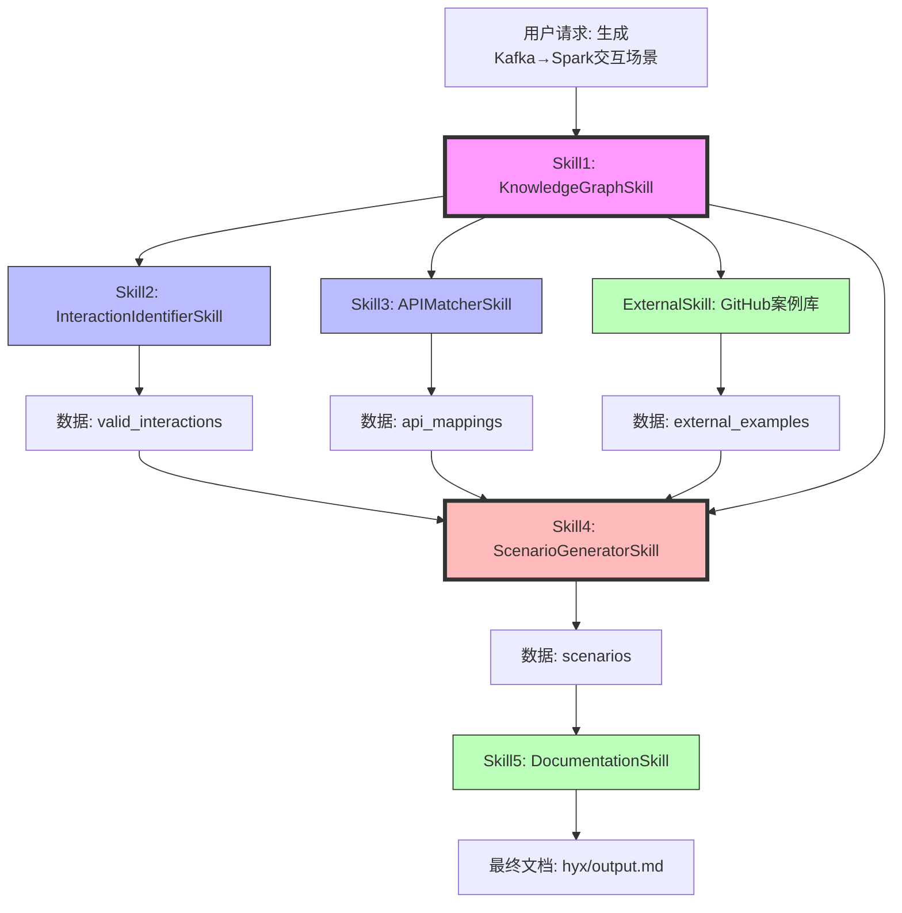
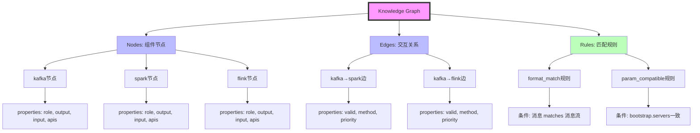
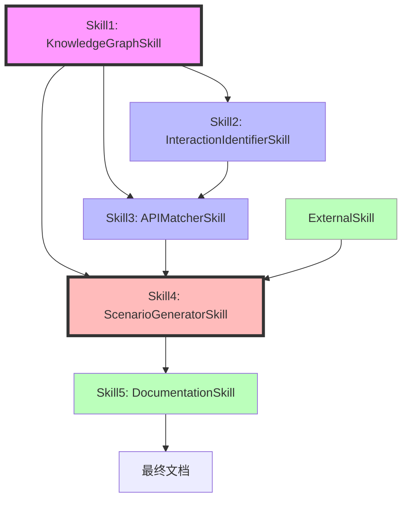
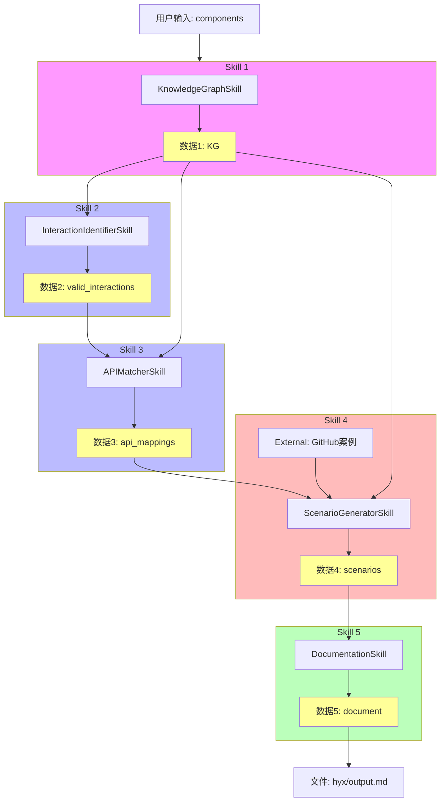
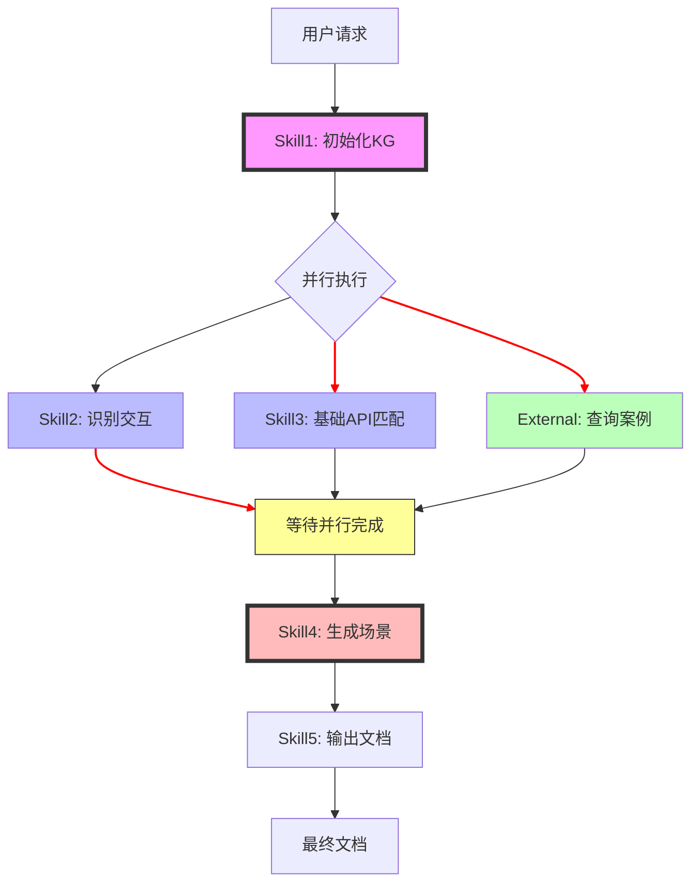
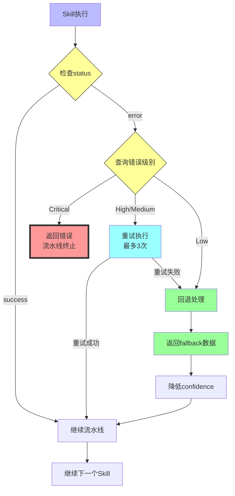
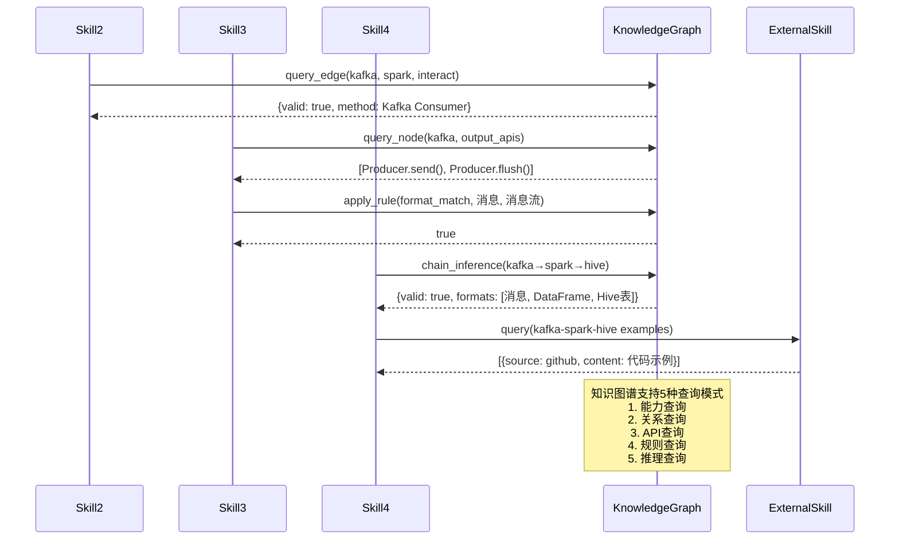
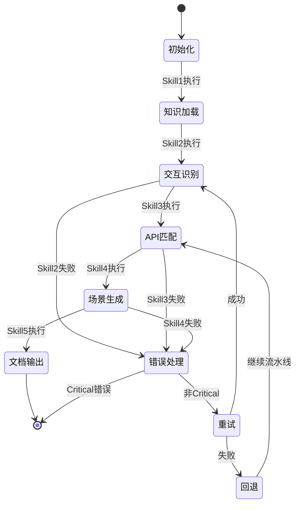
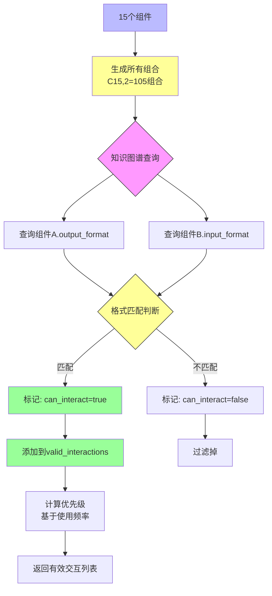

# Skill流程图（Mermaid格式）

## 图1: Skill流水线流程图



---

## 图2: Skill输入输出关系图

```mermaid
graph LR
    subgraph Skill1[Skill 1: KnowledgeGraphSkill]
        I1[Input: operation, component]
        O1[Output: KG={nodes,edges,rules}]
    end
    
    subgraph Skill2[Skill 2: InteractionIdentifierSkill]
        I2[Input: components + KG]
        O2[Output: valid_interactions]
    end
    
    subgraph Skill3[Skill 3: APIMatcherSkill]
        I3[Input: interactions + KG]
        O3[Output: api_mappings]
    end
    
    subgraph Skill4[Skill 4: ScenarioGeneratorSkill]
        I4[Input: api_mappings + KG + external]
        O4[Output: scenarios]
    end
    
    subgraph Skill5[Skill 5: DocumentationSkill]
        I5[Input: scenarios]
        O5[Output: document]
    end
    
    O1 --> I2
    O1 --> I3
    O2 --> I3
    O1 --> I4
    O3 --> I4
    O4 --> I5
    
    style Skill1 fill:#f9f
    style Skill2 fill:#bbf
    style Skill3 fill:#bbf
    style Skill4 fill:#fbb
    style Skill5 fill:#bfb
```

---

## 图3: 知识图谱结构图



---

## 图4: Skill依赖关系图



---

## 图5: 数据流全链路图



---

## 图6: 并行执行流程图



---

## 图7: 错误处理流程图



---

## 图8: Skill查询知识图谱流程



---

## 图9: Skill生命周期



---

## 图10: 组件交互识别流程



---

## 使用说明

### 在Markdown中渲染Mermaid图

1. **GitHub**: 直接支持Mermaid语法，复制粘贴即可渲染
2. **VS Code**: 安装Markdown Preview Mermaid Support插件
3. **其他平台**: 使用Mermaid Live Editor: https://mermaid.live/

### 在线渲染

将上述Mermaid代码复制到：
- https://mermaid.live/
- https://mermaid.ink/

---

**文档版本**: 1.0  
**生成时间**: 2025-05-12  
**格式**: Mermaid (支持在线渲染)
